# DP-RTFL: Differentially Private Resilient Temporal Federated Learning for Trustworthy AI in Regulated Industries

## TL;DR
DP-RTFL is an advanced federated learning framework ensuring training continuity, precise state recovery, and strong data privacy. It integrates local Differential Privacy with resilient temporal state management and zero-knowledge proofs, making it suitable for critical applications like credit risk assessment using sensitive financial data.

## Problem Description
Standard federated learning (FL) systems face significant challenges in operational resilience against concurrent client and server failures. Furthermore, they often lack robust, verifiable privacy guarantees essential for handling sensitive data, such as the financial details in `application_record.csv` and `credit_record.csv`. These deficiencies lead to risks of training disruption, data loss, model integrity issues, and non-compliance with data protection regulations (e.g., GDPR, CCPA, financial services mandates), hindering FL adoption in mission-critical sectors like banking and healthcare.

## Proposed Solution
We propose Differentially Private Resilient Temporal Federated Learning (DP-RTFL), a framework designed for continuous, auditable, and privacy-preserving training on sensitive datasets. DP-RTFL enhances the original RTFL concept by deeply integrating local Differential Privacy (LDP) at the client level. This ensures that individual contributions to model updates are protected before aggregation, alongside the framework's inherent resilience capabilities.

## Key Innovations
- **Local Differential Privacy (LDP) Integration:**
  - Client-side application of (ε, δ)-Differential Privacy to model updates (deltas) via mechanisms like Gaussian noise addition after L2 norm clipping. This formally limits information leakage about individual data records (e.g., a single credit applicant's data), directly supporting **Regulatory Compliance**.
- **Temporal Checkpoint Manifold (TCM):**
  - A distributed, chronologically ordered log of global model states and client contributions, treated as a continuous manifold. This allows for precise rollback to any point in training history, crucial for recovery and auditability.
- **Differential State Synchronization (DSS):**
  - Clients transmit only the *changes* (deltas) to the model parameters rather than full models. This significantly reduces communication overhead, especially important when updates are expanded by DP noise.
- **Adaptive Role Reassignment Protocol (ARRP):**
  - A dynamic protocol that enables eligible client devices to temporarily assume coordination duties if the central server fails, ensuring uninterrupted training progression.
- **Zero-Knowledge Integrity Proofs (ZKIP):**
  - Cryptographic proofs accompanying model updates (including noisy, differentially private deltas) and recovered states, allowing verification of their integrity and origin without revealing the sensitive data or the exact model parameters. This enhances verifiability for **Regulatory Compliance**.
- **Entropy-Based Corruption Detection (EBCD):**
  - Utilizes principles from **Information Theory** (e.g., monitoring statistical moments like variance, skewness, kurtosis of model parameters) to identify potentially corrupted or anomalous model updates, even in the presence of DP noise, by establishing dynamic baselines.

## RTFL Components: Purpose, Features, and Metrics

### 1. Local Differential Privacy (LDP)
- **Purpose:**
  - Ensure that each client's contribution to the global model is formally protected, preventing information leakage about individual data records.
- **Key Features:**
  - (ε, δ)-Differential Privacy applied to model deltas via L2 norm clipping and Gaussian noise.
  - Configurable privacy budget per client/round.
  - Privacy-preserving even if the server or coordinator is compromised.
- **Metrics:**
  - DP noise scale per round (see: DP Noise Scale plot)
  - Privacy-utility trade-off (AUC, F1, accuracy vs. ε, δ)

### 2. Temporal Checkpoint Manifold (TCM)
- **Purpose:**
  - Provide robust, auditable, and precise recovery of global model states and training history.
- **Key Features:**
  - Chronological log of all global model states and client update summaries.
  - Supports rollback and recovery to any round.
  - Enables audit trails for regulatory compliance.
- **Metrics:**
  - Number of TCM states recorded per round (see: TCM State Count plot)
  - Recovery success/failure

### 3. Differential State Synchronization (DSS)
- **Purpose:**
  - Reduce communication overhead by transmitting only model parameter deltas, not full models.
- **Key Features:**
  - Efficient delta computation and application.
  - Works seamlessly with DP noise and ZKIP.
- **Metrics:**
  - Delta norm (L2) per round (see: Delta Norm plot)
  - Communication overhead (qualitative/quantitative)

### 4. Adaptive Role Reassignment Protocol (ARRP)
- **Purpose:**
  - Ensure uninterrupted training by dynamically reassigning the coordinator role if the server fails.
- **Key Features:**
  - Automatic detection of server failure.
  - Election of a new coordinator from eligible clients.
  - Seamless failover and recovery.
- **Metrics:**
  - Server status and coordinator ID per round (see: Server Status plot)
  - Training continuity (percentage of rounds completed)

### 5. Zero-Knowledge Integrity Proofs (ZKIP)
- **Purpose:**
  - Provide cryptographic integrity and origin verification for model updates and recovered states, without revealing sensitive data.
- **Key Features:**
  - ZKIP generation and verification for all updates (including DP-noisy deltas).
  - Proofs accompany every client update and TCM recovery.
- **Metrics:**
  - ZKIP proof failures per round (see: ZKIP Proof Failures plot)
  - Per-client ZKIP status (see: Per-Client ZKIP Status plot)

### 6. Entropy-Based Corruption Detection (EBCD)
- **Purpose:**
  - Detect potentially corrupted or anomalous model updates using information-theoretic statistics, even under DP noise.
- **Key Features:**
  - Monitors variance, kurtosis, and skewness of model parameters.
  - Dynamic baseline adapts to DP noise.
  - Alerts on out-of-bounds statistics.
- **Metrics:**
  - EBCD stats (variance, kurtosis, skewness) per round (see: EBCD Stats plot)
  - EBCD alerts per round (see: EBCD Alerts plot)
  - Per-client EBCD stats (see: Per-Client EBCD plots)

### 7. Early Stopping
- **Purpose:**
  - Prevent overfitting and wasted computation by halting training when validation performance ceases to improve.
- **Key Features:**
  - Monitors best validation metric (accuracy for server, loss for clients).
  - Restores best model parameters if no improvement for configurable patience.
  - Modular, research-grade implementation (see: `earlystop.py`).
- **Metrics:**
  - Best validation accuracy per round (see: Early Stopping plot)
  - Early stopping trigger events (visible as plateaus in best metric)

## Methodology Details
In DP-RTFL, each client trains a local model on its data shard (e.g., a subset of credit application and record data). The client computes model parameter deltas using DSS. These deltas are then privatized via LDP (clipping and noise addition). The noisy, differentially private deltas, along with their ZKIPs, are sent to the current coordinator (server or ARRP-elected client). The coordinator verifies proofs, aggregates the valid noisy deltas (e.g., using Federated Averaging), and applies the aggregated update to the global model. EBCD monitors the global model for anomalies. TCM records all global states, client update summaries (including DP parameters like ε, δ, and clipping bound used for the round), and coordinator actions, providing a comprehensive audit trail. The system is designed to be validated within an **"Enterprise-grade testing environment"** to simulate real-world failure modes and recovery paths with the specified financial datasets.

## System Architecture

The following diagram illustrates the high-level architecture of the Robust Temporal Federated Learning System (DP-RTFL):

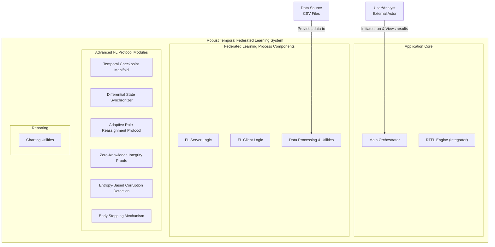

## Evaluation Metrics
- **Privacy-Utility Trade-off:**
  - Assess model performance (e.g., AUC-ROC, F1-score for credit approval prediction on `application_record.csv` and `credit_record.csv`) against varying Differential Privacy budgets (ε, δ) and L2 clipping norms.
- **Resilience & Recovery Precision:**
  - Measure training continuity (e.g., percentage of rounds completed) under simulated concurrent client/server failures and the fidelity of model state recovery via TCM (e.g., L2 distance to pre-failure model).
- **Communication & Computation Overhead:**
  - Quantify the overhead introduced by DSS, LDP noise, ZKIP generation/verification, and TCM logging.
- **EBCD Effectiveness under DP:**
  - Evaluate true/false positive rates of EBCD in detecting malicious or malformed updates when legitimate updates are already noisy due to DP.
- **Auditability for Regulatory Compliance:**
  - Qualitative assessment of TCM's ability to provide a comprehensive and verifiable audit trail suitable for regulatory scrutiny in financial services.

## Example Plots & Metrics

- **Global Model Metrics**
  - 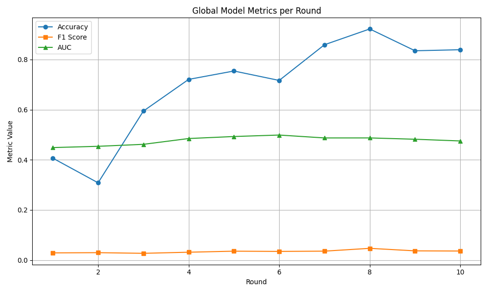
- **EBCD Statistics**
  - 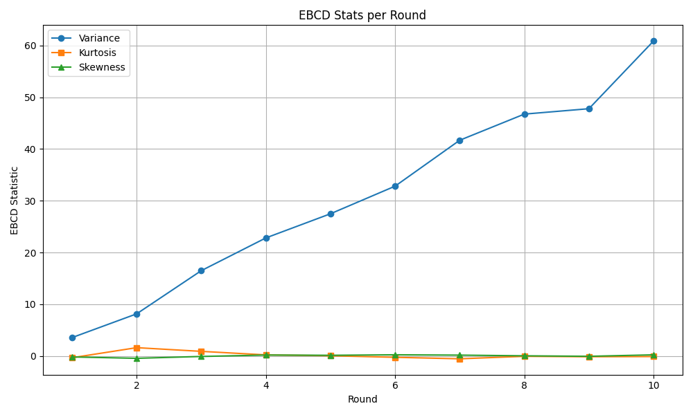
- **Server Status & Coordinator**
  - 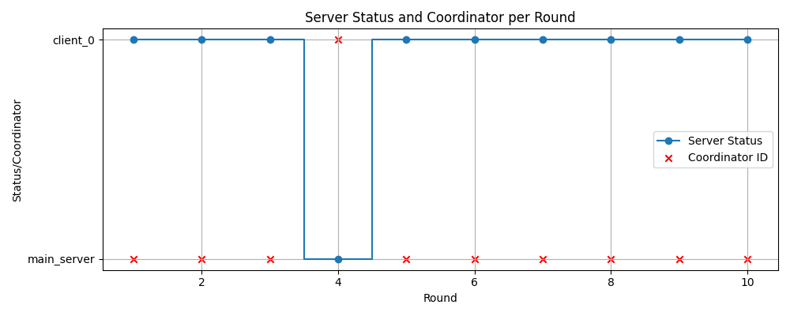
- **DP Noise Scale**
  - 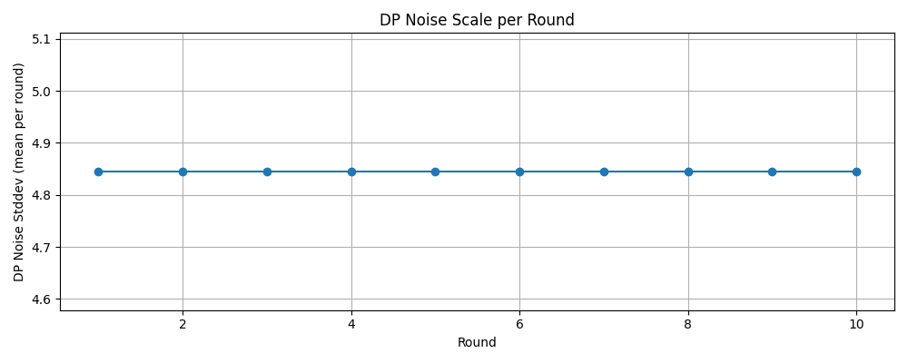
- **Aggregated Client Count**
  - 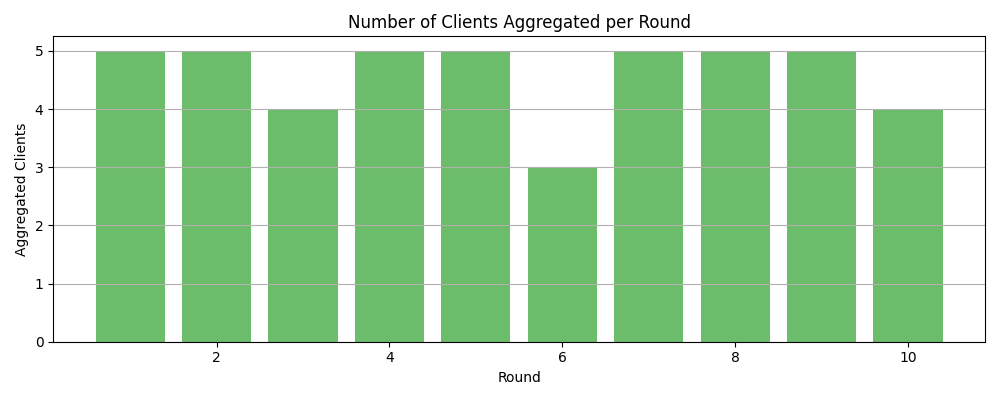
- **ZKIP Proof Failures**
  - 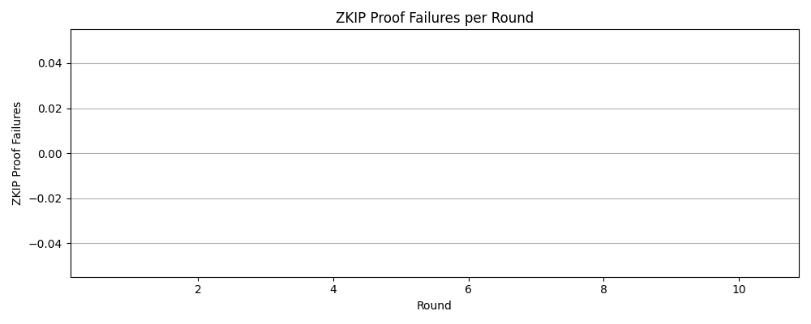
- **Delta Norm (DSS)**
  - 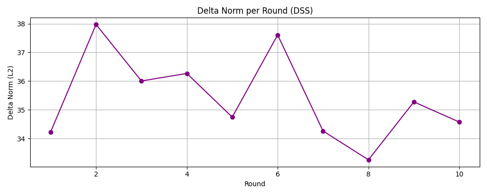
- **EBCD Alerts**
  -  per round.")
- **TCM State Count**
  - 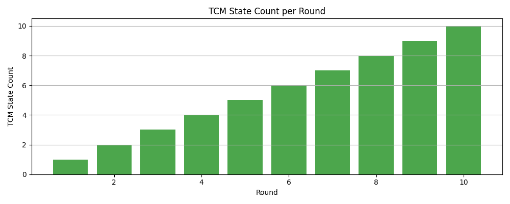
- **Early Stopping (Server)**
  - 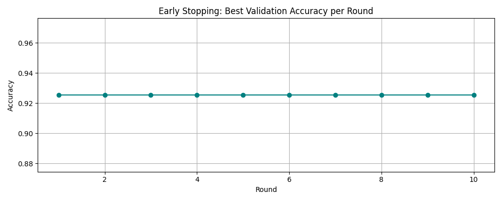
- **Per-Client Update Norms**
  - 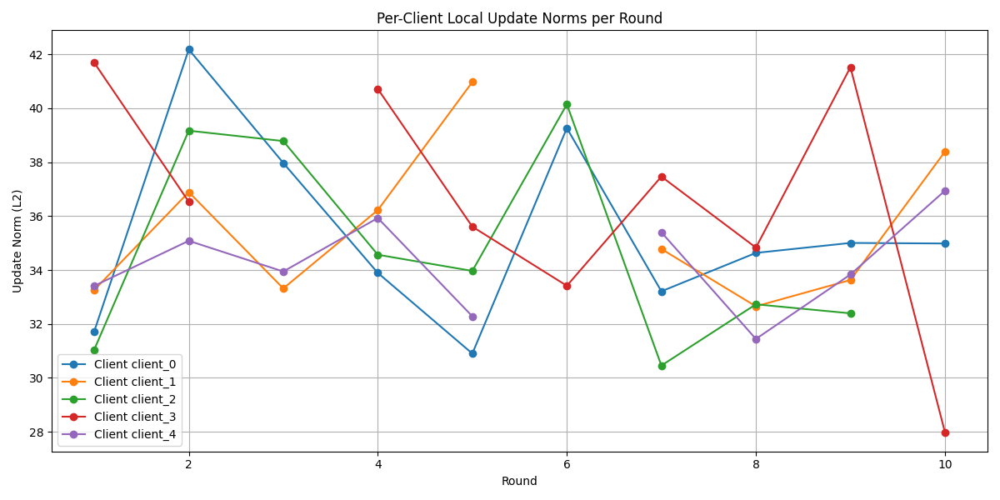
- **Per-Client EBCD Stats**
  - 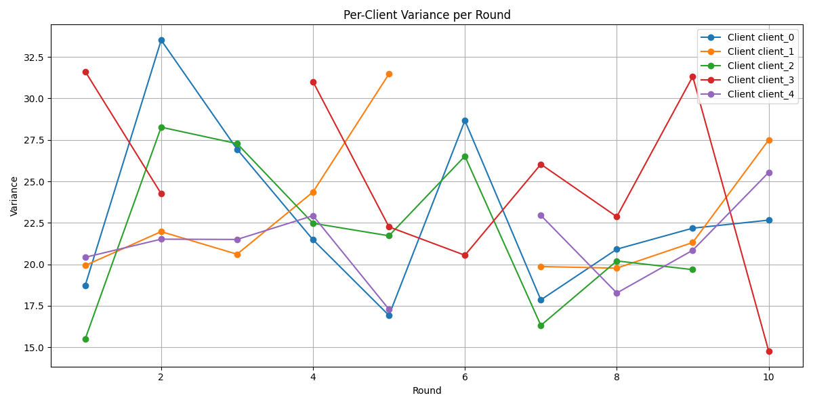
  - 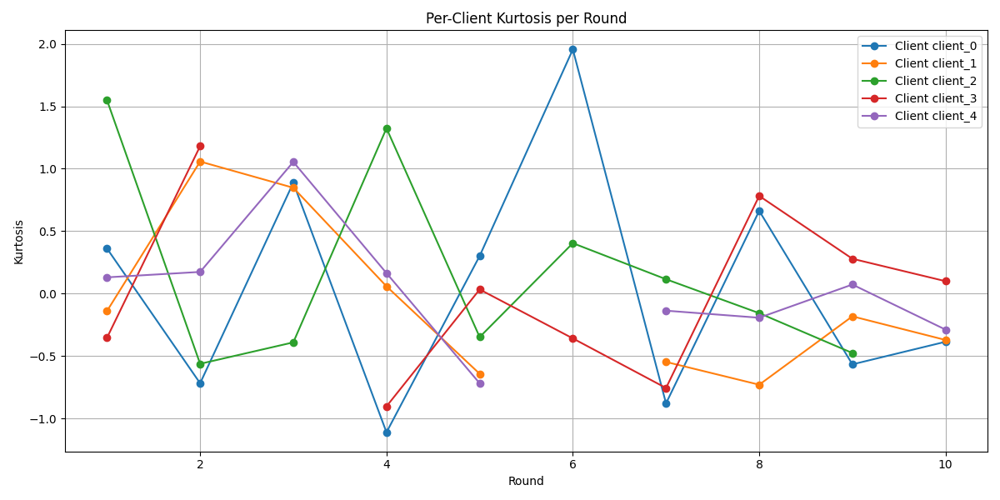
  - 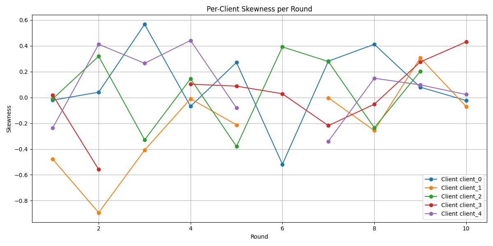
- **Per-Client ZKIP Status**
  -  for each client per round.")

Each plot includes ALT text for accessibility and quick understanding of the visualized metric.

## Potential Impact
**Scientific:**
- Advances the state-of-the-art in trustworthy distributed AI by providing a novel, theoretically grounded framework that cohesively integrates strong privacy (Differential Privacy), verifiable integrity (ZKIP), fault tolerance (TCM, ARRP), and anomaly detection (EBCD using **Information Theory**).

**Practical:**
- Enables the adoption of Federated Learning for high-stakes applications involving sensitive data, such as credit scoring (using datasets like `application_record.csv` and `credit_record.csv`), fraud detection, and medical image analysis, by satisfying stringent **Regulatory Compliance** requirements.
- Reduces operational risks and costs associated with training disruptions and data breaches in enterprise AI deployments.
- Provides a robust solution for other distributed learning scenarios beyond finance and healthcare, such as IoT analytics and smart city applications where data privacy and system resilience are paramount.

## Required Resources and Expertise
**Expertise:**
- Federated Learning
- Distributed Systems
- Differential Privacy
- Cryptography (Zero-Knowledge Proofs)
- **Information Theory**
- **Regulatory Compliance** (especially GDPR, CCPA, financial data handling regulations)

**Resources:**
- Access to relevant sensitive datasets for simulation (e.g., `application_record.csv`, `credit_record.csv` or realistic synthetic equivalents).
- An **"Enterprise-grade testing environment"** capable of simulating diverse failure scenarios and network conditions.
- High-performance computing resources for large-scale simulations and ZKP computations.
- A testbed of diverse edge devices to evaluate ARRP and client-side mechanisms.

## Keywords
Federated Learning, Resilient Systems, Differential Privacy, Temporal State Management, Zero-Knowledge Proofs, Information Theory, Regulatory Compliance, Fault Tolerance, Credit Risk Assessment, Secure AI, Trustworthy AI, Enterprise AI, Banking Technology
